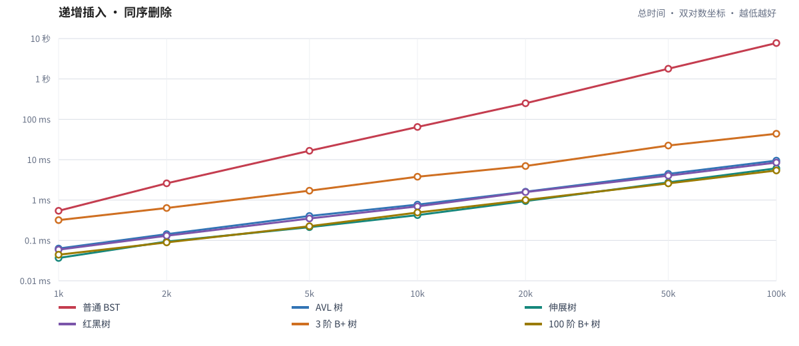
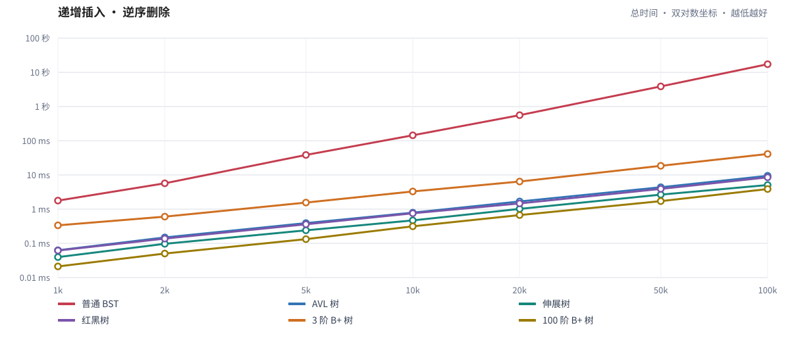
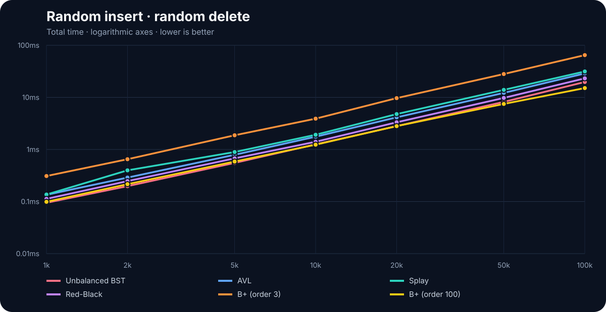

<!-- .slide: class="cover-slide" -->

<div class="eyebrow">ADVANCED DATA STRUCTURES · COURSE PROJECT</div>

# Search Trees<br><span class="accent">Under Pressure</span>

<p class="subtitle">A practical comparison of BST, AVL, Splay, Red-Black and B+ trees</p>

<div class="badge-row">
  <span>5 structures</span><span>6 configurations</span><span>126 measurements</span>
</div>

<div class="nav-hint"><kbd>←</kbd><kbd>→</kbd> switch chapters　 <kbd>↑</kbd><kbd>↓</kbd> explore a chapter　 <kbd>Esc</kbd> overview</div>

Note:
开场：我们的目标不是只背复杂度，而是观察同一批操作如何让不同树产生完全不同的结构和运行时间。
左右方向键切换大章节，上下方向键浏览当前章节。

<!-- h -->

<!-- .slide: class="chapter-cover" -->

<div class="chapter-number">01</div>

# Foundations

One interface, five balancing philosophies

<div class="chapter-map">Problem → Scope → Unified API</div>

Note:
第一章介绍研究问题、比较范围和统一树接口。按下方向键进入本章。

<!-- v -->

<div class="eyebrow">01 · FOUNDATIONS</div>

# The question behind the project

<div class="question-box">
  <div class="question-mark">?</div>
  <div><h3>How much does tree structure matter?</h3><p>Apply the same insertion and deletion sequences to every implementation, then compare the measured cost.</p></div>
</div>

<div class="cards three">
  <article><b>↕</b><h3>Shape</h3><p>Can the tree become a chain, or is height controlled?</p></article>
  <article><b>↻</b><h3>Maintenance</h3><p>What rotations, recolouring, splitting, or merging are required?</p></article>
  <article><b>⇄</b><h3>Workload</h3><p>How strongly does operation order affect time?</p></article>
</div>

Note:
强调三个影响因素：树高、维护开销和操作顺序。后续实现与结果会分别对应这三个因素。

<!-- v -->

<div class="eyebrow">01 · FOUNDATIONS</div>

# Scope at a glance

<div class="stats">
  <div><b>5</b><span>tree families</span></div>
  <div><b>6</b><span>configurations</span></div>
  <div><b>3</b><span>workloads</span></div>
  <div><b>7</b><span>input sizes</span></div>
  <div><b>126</b><span>CSV rows</span></div>
</div>

<div class="tree-legend">
  <span class="bst">Unbalanced BST</span><span class="avl">AVL</span><span class="splay">Splay</span>
  <span class="rb">Red-Black</span><span class="bp3">B+ order 3</span><span class="bp100">B+ order 100</span>
</div>

<div class="callout">N = 1k, 2k, 5k, 10k, 20k, 50k and 100k</div>

Note:
B+ 树采用相同算法测试两个阶数，因此五类数据结构对应六种配置。

<!-- v -->

<div class="eyebrow">01 · FOUNDATIONS</div>

# One public interface

<div class="two-column code-layout">

```c
typedef struct TreeInterface {
    void *object;
    void (*insert)(void *, int);
    void (*remove)(void *, int);
    int  (*contains)(void *, int);
    void (*destroy)(void *);
    const char *name;
} TreeInterface;
```

<div class="stack-list">
  <div><b>object</b><span>Concrete tree state hidden behind <code>void *</code></span></div>
  <div><b>operations</b><span>Function pointers dispatch to each implementation</span></div>
  <div><b>name</b><span>Labels CSV output without special-case code</span></div>
</div>

</div>

<div class="callout">The benchmark loop is identical for every tree. Only the function pointers change.</div>

Note:
benchmark 不访问具体节点，只调用统一函数指针。这是保证测试代码一致的核心。
contains 已实现，但原始实验只计时插入和删除。

<!-- h -->

<!-- .slide: class="chapter-cover" -->

<div class="chapter-number">02</div>

# Tree Implementations

Five strategies for controlling—or exploiting—shape

<div class="chapter-map">BST ↓ AVL ↓ Splay ↓ Red-Black ↓ B+</div>

Note:
第二章讲实现。右方向键可以直接跳到下一大章；下方向键逐种查看树。

<!-- v -->

<div class="eyebrow">02 · TREE IMPLEMENTATIONS</div>

# Unbalanced BST

<div class="two-column">
  <div>
    <h3 class="accent">Minimal maintenance</h3>
    <ul>
      <li>Ordinary binary-search ordering</li>
      <li>Iterative insertion, lookup, deletion and destruction</li>
      <li>No height, colour or parent metadata</li>
      <li>Two-child deletion uses the in-order successor</li>
    </ul>
    <div class="complexity"><span>Average</span><b>O(log N)</b><span>Worst</span><b class="danger">O(N)</b></div>
  </div>
  <div class="diagram-panel">
    <div class="chain"><span>0</span><i></i><span>1</span><i></i><span>2</span><i></i><span>3</span><i></i><span>…</span><i></i><span>N−1</span></div>
    <p>Increasing insertion creates a right chain of height N.</p>
  </div>
</div>

Note:
第 i 次递增插入大约经过 i 个节点，总插入成本成为 O(N²)。删除顺序还会进一步改变代价。

<!-- v -->

<div class="eyebrow">02 · TREE IMPLEMENTATIONS</div>

# AVL tree

<div class="two-column">
  <div class="diagram-panel formula-panel">
    <span>BF(x) = h(left) − h(right)</span>
    <b>|BF(x)| ≤ 1</b>
    <div class="tag-row"><i>LL</i><i>LR</i><i>RR</i><i>RL</i></div>
  </div>
  <div>
    <h3 class="accent">Strict height control</h3>
    <ul>
      <li>Each node caches its subtree height</li>
      <li>Ancestors rebalance as recursion unwinds</li>
      <li>Single or double rotations repair violations</li>
      <li>Lookup does not modify tree shape</li>
    </ul>
    <div class="complexity"><span>All operations</span><b>O(log N)</b><span>Trade-off</span><b>more rotations</b></div>
  </div>
</div>

Note:
AVL 最严格地限制高度，查找路径短且稳定；代价是更新高度并执行旋转。

<!-- v -->

<div class="eyebrow">02 · TREE IMPLEMENTATIONS</div>

# Splay tree

<div class="two-column">
  <div>
    <h3 class="accent">Adapt to recent access</h3>
    <ul>
      <li>Bottom-up recursive splaying</li>
      <li>Zig-zig and zig-zag rotations</li>
      <li>Insertion exposes its position at the root</li>
      <li>Successful and unsuccessful lookup reshape the tree</li>
    </ul>
    <div class="complexity"><span>Amortized</span><b>O(log N)</b><span>One operation</span><b class="warning">may be O(N)</b></div>
  </div>
  <div class="diagram-panel splay-diagram">
    <div><span>30</span><span>20</span><span>10</span></div><b>→</b><div class="reverse"><span>10</span><span>20</span><span>30</span></div>
    <p>zig-zig moves the accessed key to the root</p>
  </div>
</div>

Note:
本项目使用 bottom-up splay。contains 也会伸展命中节点或最后访问节点，但查询不在当前 benchmark 中。

<!-- v -->

<div class="eyebrow">02 · TREE IMPLEMENTATIONS</div>

# Red-Black tree

<div class="two-column">
  <div class="diagram-panel rb-diagram">
    <div><span class="black-node">20</span></div>
    <i>╱　　　　　　　╲</i>
    <div><span class="red-node">10</span><span class="red-node">30</span></div>
    <i>╱　╲　　　　　╱　╲</i>
    <div class="nil-row"><span>NIL</span><span>NIL</span><span>NIL</span><span>NIL</span></div>
  </div>
  <div>
    <h3 class="accent">Relaxed balance by colour</h3>
    <ul>
      <li>Parent pointers support local repair</li>
      <li>One shared black <code>nil</code> sentinel represents leaves</li>
      <li>Insertion repairs red-red conflicts</li>
      <li>Deletion restores equal black height</li>
    </ul>
    <div class="complexity"><span>All operations</span><b>O(log N)</b><span>Strength</span><b>bounded height</b></div>
  </div>
</div>

Note:
红黑树不追求 AVL 那样严格的平衡，而是用颜色规则保证最长路径不超过最短路径的两倍。

<!-- v -->

<div class="eyebrow">02 · TREE IMPLEMENTATIONS</div>

# B+ tree

<div class="bplus-diagram">
  <div class="bplus-root"><span>20</span><span>50</span><span>80</span></div>
  <div class="fan">╱　　　　│　　　　│　　　　╲</div>
  <div class="bplus-leaves"><span>3 · 8 · 12</span><i>→</i><span>20 · 31</span><i>→</i><span>50 · 67</span><i>→</i><span>80 · 91</span></div>
</div>

<div class="cards three compact">
  <article><h3>Internal nodes</h3><p>Routing separators and many child pointers</p></article>
  <article><h3>Leaves</h3><p>All data keys in a doubly linked chain</p></article>
  <article><h3>Updates</h3><p>Split on overflow; borrow or merge on underflow</p></article>
</div>

Note:
separator i 等于 child i+1 子树的最小键。内部节点和叶节点都使用二分查找。

<!-- v -->

<div class="eyebrow">02 · TREE IMPLEMENTATIONS</div>

# Why two B+ orders?

<div class="order-comparison">
  <article class="order-3"><strong>3</strong><h3>Small fanout</h3><p>At most 3 children</p><ul><li>More levels</li><li>More allocations</li><li>Frequent split / merge</li></ul></article>
  <b>VS</b>
  <article class="order-100"><strong>100</strong><h3>Large fanout</h3><p>At most 100 children</p><ul><li>Shallow tree</li><li>Contiguous arrays</li><li>Binary search in each node</li></ul></article>
</div>

<div class="callout">Same implementation, different <code>order</code> parameter.</div>

Note:
这组对比说明参数选择也会显著改变常数开销。这是内存测试，不能直接推广为磁盘数据库的最佳阶数。

<!-- v -->

<div class="eyebrow">02 · TREE IMPLEMENTATIONS</div>

# Complexity expectations

| Structure | Search | Insert | Delete | Guarantee |
|---|---:|---:|---:|---|
| Unbalanced BST | avg. O(log N), worst O(N) | same | same | none |
| AVL | O(log N) | O(log N) | O(log N) | strict height |
| Splay | amortized O(log N) | amortized O(log N) | amortized O(log N) | locality |
| Red-Black | O(log N) | O(log N) | O(log N) | bounded height |
| B+ order m | O(logₘ N) node visits | same | same | occupancy |

<div class="callout">Theory predicts growth; measurements also include allocation, cache, branches and rebalancing.</div>

Note:
同为 O(log N) 不代表时间相同。渐进复杂度描述增长趋势，具体排名还取决于常数。

<!-- h -->

<!-- .slide: class="chapter-cover" -->

<div class="chapter-number">03</div>

# Experiment Design

Controlled inputs, identical operations, separate timers

<div class="chapter-map">Workloads ↓ Pipeline ↓ Timing ↓ Fairness</div>

Note:
第三章解释 benchmark，重点是输入一致、计时边界和实验范围。

<!-- v -->

<div class="eyebrow">03 · EXPERIMENT DESIGN</div>

# Three required workloads

<div class="scenario-grid">
  <article><b>01</b><h3>Increasing → Same</h3><code>0 1 2 … N−1</code><code class="delete">0 1 2 … N−1</code></article>
  <article><b>02</b><h3>Increasing → Reverse</h3><code>0 1 2 … N−1</code><code class="delete">N−1 … 2 1 0</code></article>
  <article><b>03</b><h3>Random → Random</h3><code>7 1 9 3 …</code><code class="delete">4 9 0 7 …</code></article>
</div>

<div class="callout">Every array contains exactly the N distinct integers 0 … N−1.</div>

Note:
malloc 的原始内容不会被使用。make_keys 先完整写入 0 到 N−1，再按场景反转或打乱。

<!-- v -->

<div class="eyebrow">03 · EXPERIMENT DESIGN</div>

# Benchmark pipeline

<div class="pipeline">
  <div><b>1</b><span>Allocate arrays</span></div><i>→</i>
  <div><b>2</b><span>Prepare scenario</span></div><i>→</i>
  <div><b>3</b><span>Create empty tree</span></div><i>→</i>
  <div class="active"><b>4</b><span>Time inserts</span></div><i>→</i>
  <div class="active"><b>5</b><span>Time deletes</span></div><i>→</i>
  <div><b>6</b><span>Print and destroy</span></div>
</div>

<div class="cards two compact">
  <article><h3>Inside timers</h3><p>Only calls to <code>insert</code> or <code>remove</code></p></article>
  <article><h3>Outside timers</h3><p>Preparation, construction, printing and destruction</p></article>
</div>

Note:
每个 tree/scenario/N 组合都从新树开始。先完成 N 次插入，再在同一棵树上完成 N 次删除。

<!-- v -->

<div class="eyebrow">03 · EXPERIMENT DESIGN</div>

# Timing and CSV output

<div class="two-column code-layout">

```c
insert_start = current_time_ns();
for (i = 0; i < n; ++i)
    tree.insert(tree.object, insert_keys[i]);
insert_end = current_time_ns();

delete_start = current_time_ns();
for (i = 0; i < n; ++i)
    tree.remove(tree.object, delete_keys[i]);
delete_end = current_time_ns();
```

<div class="stack-list">
  <div><b>CLOCK_MONOTONIC</b><span>Unaffected by wall-clock changes</span></div>
  <div><b>Nanoseconds</b><span>Insertion and deletion recorded separately</span></div>
  <div><b>C11 + O2</b><span>Identical compiler flags for all trees</span></div>
</div>

</div>

<div class="csv-line">tree, scenario, n, insert_ns, delete_ns, total_ns</div>

Note:
CSV 一共 126 条测量。current_time_ns 使用单调时钟，避免系统时间调整影响时间差。

<!-- v -->

<div class="eyebrow">03 · EXPERIMENT DESIGN</div>

# Fairness choices

<div class="check-grid">
  <article><b>✓</b><div><h3>Same keys</h3><p>Every tree receives 0 … N−1.</p></div></article>
  <article><b>✓</b><div><h3>Same order</h3><p>One prepared sequence is reused.</p></div></article>
  <article><b>✓</b><div><h3>Same interface</h3><p>Identical indirect operation calls.</p></div></article>
  <article><b>✓</b><div><h3>Fresh state</h3><p>Every measurement starts empty.</p></div></article>
</div>

<div class="callout warning-box"><b>Scope:</b> lookup is implemented but not timed because the assignment specifies insertion and deletion sequences.</div>

Note:
随机种子由 N 和 N+1 决定，所以数据可复现，而且不同树收到相同顺序。
Splay 查询会改变结构，因此若加入查询应作为独立实验。

<!-- h -->

<!-- .slide: class="chapter-cover" -->

<div class="chapter-number">04</div>

# Results

Logarithmic plots reveal both catastrophic and constant-factor differences

<div class="chapter-map">Same order ↓ Reverse ↓ Random ↓ Interpretation</div>

Note:
第四章展示实测结果。上下方向依次查看三种场景及分析。

<!-- v -->

<div class="eyebrow">04 · RESULTS</div>

# How to read the plots

<div class="cards three plot-guide">
  <article><b>X</b><h3>Input size N</h3><p>1,000 to 100,000 on a logarithmic axis</p></article>
  <article><b>Y</b><h3>Total time</h3><p>Insertion + deletion, milliseconds, logarithmic axis</p></article>
  <article><b>↘</b><h3>Lower is better</h3><p>Curve shape shows growth; spacing shows constants</p></article>
</div>

<div class="callout">Log scale prevents the degenerated BST from flattening every other curve.</div>

Note:
先解释坐标再读图。看曲线斜率判断增长趋势，再看相近曲线之间的常数差异。

<!-- v -->

<div class="eyebrow">04 · RESULTS · WORKLOAD 1</div>

# Increasing → Same



Note:
普通 BST 从 0.54 ms 增长到 7753.85 ms，呈现明显平方级趋势。其余结构保持在几十毫秒以内。

<!-- v -->

<div class="eyebrow">04 · RESULTS · WORKLOAD 1</div>

# Why workload 1 looks like this

<div class="result-hero">
  <div><span>BST @ 100k</span><b>7.754 s</b></div><i>vs</i>
  <div><span>B+ order 100 @ 100k</span><b class="accent">5.406 ms</b></div>
  <strong>≈ 1,434×</strong>
</div>

<div class="cards three compact">
  <article><h3>BST</h3><p>Increasing insertion builds a right chain: O(N²) total.</p></article>
  <article><h3>Splay</h3><p>Each new maximum remains close to the root.</p></article>
  <article><h3>B+ order 100</h3><p>Low height and contiguous nodes offset update work.</p></article>
</div>

Note:
同序删除右链 BST 时总是删除当前根，删除本身便宜，但插入阶段已经付出平方级代价。

<!-- v -->

<div class="eyebrow">04 · RESULTS · WORKLOAD 2</div>

# Increasing → Reverse



Note:
这是 BST 最差的一组：递增插入形成右链，反序删除又反复寻找最右端。

<!-- v -->

<div class="eyebrow">04 · RESULTS · WORKLOAD 2</div>

# Reverse deletion amplifies the chain

<div class="result-hero">
  <div><span>BST @ 100k</span><b>17.294 s</b></div><i>vs</i>
  <div><span>B+ order 100 @ 100k</span><b class="accent">3.872 ms</b></div>
  <strong>≈ 4,466×</strong>
</div>

<div class="chain-cost">
  <span>find N−1</span><i>N steps</i><span>find N−2</span><i>N−1 steps</i><span>find N−3</span><i>N−2 steps</i><b>Σ ≈ O(N²)</b>
</div>

<div class="callout">Input order changes BST by seconds; balanced structures change by milliseconds.</div>

Note:
AVL 和红黑树靠高度约束稳定。Splay 也适合这个局部访问模式。order 100 是本组最快配置。

<!-- v -->

<div class="eyebrow">04 · RESULTS · WORKLOAD 3</div>

# Random → Random



Note:
随机顺序消除了 BST 的结构性灾难，六条曲线明显靠近，这时常数开销成为主要差异。

<!-- v -->

<div class="eyebrow">04 · RESULTS · WORKLOAD 3</div>

# Random order changes the ranking

<div class="ranking">
  <div class="first"><span>1</span><b>B+ order 100</b><em>15.11 ms</em></div>
  <div><span>2</span><b>Unbalanced BST</b><em>19.76 ms</em></div>
  <div><span>3</span><b>Red-Black</b><em>23.17 ms</em></div>
  <div><span>4</span><b>AVL</b><em>28.84 ms</em></div>
  <div><span>5</span><b>Splay</b><em>31.46 ms</em></div>
  <div><span>6</span><b>B+ order 3</b><em>64.77 ms</em></div>
</div>

<p class="footnote">Total time at N = 100,000; one recorded run.</p>

Note:
随机 BST 的期望高度接近对数级，且无需旋转，因此本次比 AVL、Splay 和红黑树更快；这不是最坏情况保证。

<!-- v -->

<div class="eyebrow">04 · RESULTS</div>

# 100k snapshot

<table class="result-table">
  <thead><tr><th>Tree</th><th>Increasing / same</th><th>Increasing / reverse</th><th>Random / random</th></tr></thead>
  <tbody>
    <tr><td>Unbalanced BST</td><td class="danger">7753.85 ms</td><td class="danger">17294.24 ms</td><td>19.76 ms</td></tr>
    <tr><td>AVL</td><td>9.50 ms</td><td>9.44 ms</td><td>28.84 ms</td></tr>
    <tr><td>Splay</td><td>6.11 ms</td><td>5.08 ms</td><td>31.46 ms</td></tr>
    <tr><td>Red-Black</td><td>8.48 ms</td><td>8.51 ms</td><td>23.17 ms</td></tr>
    <tr><td>B+ order 3</td><td>43.89 ms</td><td>41.11 ms</td><td>64.77 ms</td></tr>
    <tr class="winner"><td>B+ order 100</td><td>5.41 ms</td><td>3.87 ms</td><td>15.11 ms</td></tr>
  </tbody>
</table>

<p class="footnote">Fastest in this dataset does not mean universally optimal.</p>

Note:
原 CSV 使用纳秒，这里转换为毫秒便于阅读。强调本表是单次实验快照。

<!-- v -->

<div class="eyebrow">04 · RESULTS</div>

# What the B+ comparison teaches

<div class="big-ratio">order 3 <span>→</span> order 100</div>

<div class="ratio-grid">
  <div><b>8.1×</b><span>increasing / same</span></div>
  <div><b>10.6×</b><span>increasing / reverse</span></div>
  <div><b>4.3×</b><span>random / random</span></div>
</div>

<div class="callout">High fanout reduces height and pointer chasing, but the best order depends on cache, key size, node search and storage.</div>

Note:
倍数由 N=100k 的总时间计算。order 100 在整数键、内存运行、节点内二分查找条件下表现很好。

<!-- v -->

<div class="eyebrow">04 · RESULTS</div>

# Theory explains shape; implementation explains gaps

<div class="equation-cards">
  <article><span>Asymptotic structure</span><h3>How fast does the curve grow?</h3><p>BST degeneration creates the only catastrophic O(N²) sequence.</p></article>
  <b>+</b>
  <article><span>Constant factors</span><h3>Where does each operation spend time?</h3><p>Rotations, allocation, cache locality, recursion and fanout separate O(log N) trees.</p></article>
</div>

<div class="takeaway">Big-O predicts scalability—not the winner of every finite benchmark.</div>

Note:
不要根据一张表宣布某种树永远最好。结构保证决定增长上限，实现细节决定有限规模下的差距。

<!-- v -->

<div class="eyebrow">04 · RESULTS</div>

# Limits of this experiment

<div class="limits">
  <article><b>01</b><h3>One run</h3><p>No variance or confidence interval.</p></article>
  <article><b>02</b><h3>Fixed tree order</h3><p>System noise may favour one position.</p></article>
  <article><b>03</b><h3>Updates only</h3><p>Lookup and range queries are outside scope.</p></article>
  <article><b>04</b><h3>One platform</h3><p>Hardware and allocator affect constants.</p></article>
</div>

<div class="callout warning-box">Stronger follow-up: repeat trials, randomize tree order, report the median and record the environment.</div>

Note:
主动说明实验边界。当前实现满足课程要求，但更严格的实证研究需要重复试验和环境记录。

<!-- h -->

<!-- .slide: class="chapter-cover" -->

<div class="chapter-number">05</div>

# Conclusions

Choose a tree by guarantees and workload—not by name

<div class="chapter-map">Takeaways ↓ Reproduce ↓ Questions</div>

Note:
最后一章总结三个核心结论，并说明如何复现实验和幻灯片。

<!-- v -->

<div class="eyebrow">05 · CONCLUSIONS</div>

# Three takeaways

<div class="conclusions">
  <article><b>1</b><div><h3>Balance protects against adversarial order</h3><p>AVL, Red-Black, Splay and B+ avoid the BST's multi-second degeneration.</p></div></article>
  <article><b>2</b><div><h3>Access pattern is part of the algorithm</h3><p>Splay benefits from locality; ordinary BST behaviour changes dramatically with order.</p></div></article>
  <article><b>3</b><div><h3>Parameters and constants matter</h3><p>B+ order 100 strongly outperforms order 3 in this in-memory benchmark.</p></div></article>
</div>

Note:
一句话总结：结构保证决定上限，工作负载决定实际形状，实现细节决定常数。

<!-- v -->

<div class="eyebrow">05 · CONCLUSIONS</div>

# Reproduce everything

<div class="two-column code-layout">

<div>

### Tree benchmark

```bash
make benchmark
./benchmark > result.csv
```

Produces the 126-row dataset.

</div>

<div>

### Web slides

```bash
npm install
npm run charts
npm run dev
npm run build
```

Builds a static Reveal.js website.

</div>

</div>

<div class="pipeline small-pipeline"><div>CSV</div><i>→</i><div>SVG charts</div><i>→</i><div>Reveal.js</div><i>→</i><div class="active">GitHub Pages</div></div>

Note:
数据、图表和网页都可以从仓库复现。组员通过分支和 PR 协作，main 自动部署。

<!-- v -->

<!-- .slide: class="final-slide" -->

<div class="eyebrow">SEARCH TREE COMPARISON</div>

# Questions?

<p class="subtitle">Structure shapes performance.</p>

<div class="final-equation"><span>Guarantees</span><b>×</b><span>Workload</span><b>×</b><span>Implementation</span></div>

<div class="nav-hint"><kbd>Esc</kbd> overview　 <kbd>←</kbd><kbd>→</kbd> chapters　 <kbd>↑</kbd><kbd>↓</kbd> details</div>

Note:
结束。提问时按 Esc 打开二维总览，可以快速返回任意章节或页面。
